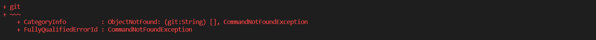
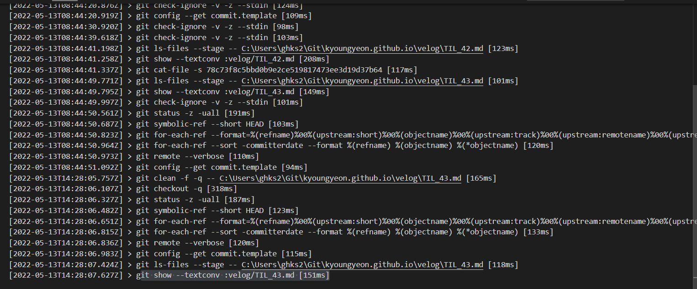
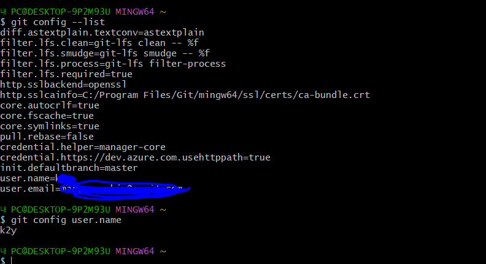
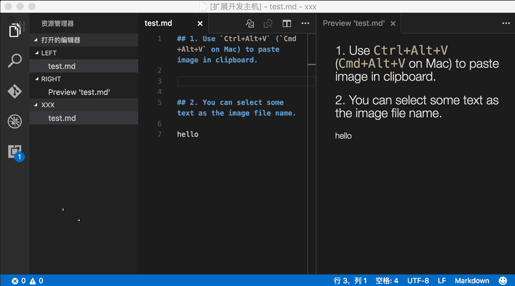
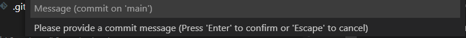

# err 1 Windows vscode terminal에서 git clone/ git init 이 안되는 상황 반복적으로 발생
- status:  문서작업때문에  windows OS로 작업중, vscode를 window OS에선 안쓰고 방치함 
- 솔루션 1 : vs  버전 업그레이드 해봄 -> NO

- 솔루션 2 : git 명령어가 인식 안되서 확인해보니 windows는 


 # err 2 img 마크 다운 삽입이 ubuntu와 다름 / 터미널 사용불가
 
- 원인분석: git 이 반복해서 안깔려 있다고 나옴



- 원인분석 : output log를 봄


해결 1: git 이 안깔려있다고 해서 시도 -> No

- 터미널로는 해결이 안된다는걸 직감함

원인 분석: VSCode 에서 자체적으로 Git을 지원하지 않기 때문에 연동 하려면 다운을 받아야 한다고 한다. 
[출처](https://kaikaikai.tistory.com/93)

해결 final : git scm 다운 
= > git auth = vs 연결 
= > source control repositories clone repo 연결 완료

의문점 : 왜 터미널 못쓰냐.. 오히려 불편 


# err 3 vscode  add / commit / push/ pull를 어디서 해야할지

원인분석 1 깔긴 했는데 사용법을 모르는 git scm 
- 다시 사용법 봄

해결 1 : 
 - git bash 사용함
- git config 설정 

```
$ git config --global user.name "John Doe"
$ git config --global user.email johndoe@example.com
```       


- 이후 정상 stage change > v 체크버튼 누르면 정상 commit 됌

- git fetch를 periodically 할건지 묻는 창이 나옴 - > NO 설정


# err 3 크롬에서 velog 안열림 

- 원인 분석 : 찾는중

# err 4 windows 블로그 안열리는데 markdown으로 이미지 어떻게 넣죠
status: 이미지 드래그 드롭으론 되지 않는다.

솔루션 0 : 기존 마크다운 방식으로 src 가지고 왔음 => No
  -  깨진 파일 확인

솔루션 1  : [확장팩](https://marketplace.visualstudio.com/items?itemName=mushan.vscode-paste-image) 
- 설치후 ctrl + alt + v 해봄 
- 클립보드에 이미지 없다는 경고메시지 한가득..

솔루션 Final ; 
     img 파일 생성> directory git 에 설정후 기본 마크다운 문법 진행 

[출처](https://blog.naver.com/PostView.naver?blogId=chandong83&logNo=220812226888&parentCategoryNo=&categoryNo=80&viewDate=&isShowPopularPosts=true&from=search)
# err 5 windows에서 마크다운 img 업로드 후 잘 보이는데  git 레포에서 깨짐.



- 원인분석: img 를 .gitignore 에 설정해서 생긴오류라 판단함
~~아니 확장팩 깔아서 잘 했는데 왜!~~
- 해결 1 : gitignore 해결 후 재 commit 
- 해결 final : 해결완료

# err 6 commit 시 빈메시지 push 안돼나요


원인분석: 니가 아무리 엔터처봐라 ..절대 commit 안해줌

해결 1 : 임시방편으로 messages 넣어서 해결.


